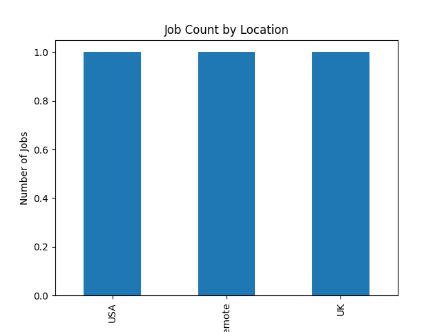

# Job Data Pipeline (Python ETL Project)

## Overview
This project demonstrates a **full ETL (Extract, Transform, Load) pipeline** in Python.  
It simulates a **data engineering workflow** by extracting job listing data, cleaning it, storing it in a database, and creating visual insights.

This project highlights practical **Python, SQL, and data pipeline skills** for data engineering portfolios.

---

## Tools & Technologies
- **Python 3.14** – programming language  
- **Pandas** – data manipulation and cleaning  
- **SQLite** – lightweight database for storing structured data  
- **Matplotlib** – data visualization  
- **Git & GitHub** – version control and portfolio showcase  

---

## ETL Pipeline Steps

### 1. Extract (`extract.py`)
- Generates a sample dataset of job listings (`jobs_raw.csv`).  
- Demonstrates basic data extraction and storage in CSV format.

### 2. Transform (`transform.py`)
- Cleans the dataset by:  
  - Lowercasing column names  
  - Removing duplicate rows  
- Saves the cleaned data as `jobs_cleaned.csv`.

### 3. Load (`load.py`)
- Loads the cleaned data into an **SQLite database** (`jobs_database.db`).  
- Demonstrates database interaction using Python and `pandas.to_sql`.

### 4. Analysis (`analysis.py`)
- Creates a **bar chart of job counts by location**.  
- Saves the chart as `job_location_chart.png`.  
- Demonstrates basic data visualization skills.

---
pip install pandas matplotlib
python extract.py
python transform.py
python load.py
python analysis.py


## How to Run the Project

1. Clone the repository:

```bash
git clone https://github.com/webdomain0126/job-data-pipeline.git
cd job-data-pipeline
